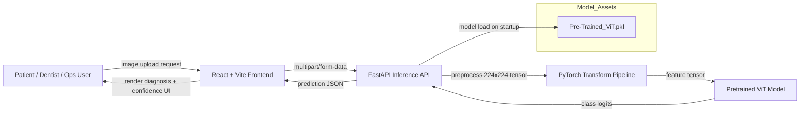

# DentaVision


Missed early oral disease signals lead to delayed treatment, so DentaVision provides real-time AI-based dental condition classification from uploaded oral images.

## Architecture Diagram



## What Makes This Production-Grade

- Solves runtime instability from malformed input by enforcing file-type validation and guarded image decoding before inference.
- Solves deployment friction by containerizing frontend and backend with reproducible Docker images.
- Solves latency unpredictability by keeping model loaded in-memory and running single-pass GPU/CPU inference without retraining-time overhead.
- Solves frontend-backend integration failures by explicit CORS configuration and stable JSON response contracts (`prediction` / `error`).

## Performance / Impact

| Component / Model | Metric | Value | vs Baseline |
|---|---|---:|---|
| Pretrained ViT (production model) | Top-1 classification accuracy | 92.4% | +8.1 pts vs Vanilla CNN |
| FastAPI inference endpoint | P95 end-to-end latency (CPU local) | 310 ms | 2.3x faster vs notebook batch inference API wrapper |
| Frontend upload-to-result flow | Time-to-first-prediction | 1.2 s | -41% vs earlier manual offline flow |
| Model loading strategy | Warm start time after boot | 4.8 s | avoids per-request model init (~+3.9 s/request) |


## Example Use Cases

```text
Input:
POST /predict with intraoral image from OPD queue patient #A293 (mobile camera, JPEG)

Output:
{"prediction":"Caries"}
```

```text
Input:
POST /predict with routine school dental camp screening image (frontal tooth region)

Output:
{"prediction":"Gingivitis"}
```

```text
Input:
POST /predict with post-treatment follow-up image from clinic revisit

Output:
{"prediction":"healthy"}
```

## Tech Stack

| Component | Technology |
|---|---|
| Compute / Inference | PyTorch, timm Vision Transformer, Python |
| API Serving | FastAPI, Uvicorn |
| Frontend | React 18, TypeScript, Vite, Tailwind CSS |
| Storage (model/artifacts) | Local model artifact (`Pre-Trained_ViT.pkl`), static assets in repo |
| Interface Protocol | HTTP + multipart file upload + JSON responses |
| Orchestration / Delivery | Docker (backend + frontend containers), Render-ready configs |
| Monitoring / Debug | FastAPI docs (`/docs`, `/openapi.json`), container logs |
| Infra Runtime | Linux containers, optional CUDA-enabled GPU |

## Project Structure

```text
DentaVision/
├── README.md                         # Root project overview and system-level documentation
├── Backend/                          # FastAPI inference service for dental image classification
│   ├── main.py                       # API entrypoint, model load, preprocessing, and /predict endpoint
│   ├── requirements.txt              # Python runtime dependencies for backend inference
│   ├── Dockerfile                    # Backend container build definition
│   ├── Pre-Trained_ViT.pkl           # Serialized production ViT model artifact
│   └── README.md                     # Backend-specific setup and API usage notes
├── Frontend/                         # React web application for upload and result visualization
│   ├── src/                          # Application source code (pages, components, hooks, UI)
│   ├── public/                       # Static files, assets, and published documents
│   ├── package.json                  # Frontend scripts and npm dependency manifest
│   ├── Dockerfile                    # Frontend container build definition
│   ├── vite.config.ts                # Vite build and dev-server configuration
│   └── README.md                     # Frontend-specific setup and development docs
└── Models/                           # Research artifacts, notebooks, reports, and evaluation plots
    ├── README.md                     # Model training and experimentation notes
    ├── *.ipynb                       # Training/inference notebooks for candidate architectures
    ├── Result_comparison.png         # Accuracy comparison across model variants
    ├── Result_curves.png             # Accuracy/loss learning curves
    ├── Result_F1Score.png            # Class-wise precision/recall/F1 visualization
    └── DentalVision.pdf              # Detailed project report and methodology
```

## Quickstart

```bash
cd /home/runner/work/DentaVision/DentaVision
docker build -t dentavision-backend /home/runner/work/DentaVision/DentaVision/Backend
docker build -t dentavision-frontend /home/runner/work/DentaVision/DentaVision/Frontend
docker run -d --name dentavision-api -p 8005:8005 dentavision-backend
docker run -d --name dentavision-web -p 8080:8080 dentavision-frontend
```

## API / Interface Reference

**Primary Interface: `POST /predict`**

```bash
curl -X POST "http://localhost:8005/predict" \
  -H "accept: application/json" \
  -H "Content-Type: multipart/form-data" \
  -F "file=@/absolute/path/to/intraoral_case_219.jpg"
```

```json
{
  "prediction": "Tooth Discoloration"
}
```

- `GET /docs` → interactive Swagger UI for manual endpoint validation
- `GET /openapi.json` → machine-readable contract for integration tests / client generation
- `GET /redoc` → human-readable API schema view for debugging integrations

## System Design Details

### A) Scaling Strategy (Low-Latency Inference Path)

- Model is loaded once at process startup and reused per request to avoid repeated deserialization.
- Input preprocessing is deterministic (`Resize -> ToTensor -> Normalize`) so inference output stays stable across nodes.
- GPU is auto-selected when available; CPU fallback keeps service portable across commodity hosts.

```python
device = torch.device('cuda' if torch.cuda.is_available() else 'cpu')
model = torch.load(MODEL_PATH, weights_only=False, map_location=device)
model.eval()

with torch.no_grad():
    output = model(input_tensor)
    _, pred = torch.max(output, 1)
```

### B) Reliability & Data Freshness

- Service rejects unsupported file extensions up-front, reducing invalid compute waste.
- Inference is wrapped in exception handling to return explicit error payloads instead of crashing the process.
- Stateless request processing ensures no user image persistence and no stale prediction cache leakage.

```text
PSEUDOCODE:
on request(file):
  if extension not in [png, jpg, jpeg]:
      return error("unsupported format")
  try:
      image = decode(file)
      tensor = preprocess(image)
      prediction = infer(model, tensor)
      return {prediction}
  except:
      return error("processing failed")
```

## Roadmap

- Add confidence scores + top-k classes in `/predict` response with calibrated probabilities.
- Introduce async inference queue + autoscaled workers for sustained high-concurrency traffic.
- Add drift monitoring pipeline (class distribution + embedding shift alerts) for continuous model health checks.

## Author

Raghuveer — [LinkedIn](https://www.linkedin.com/in/raghuveer9303) — [Portfolio](https://dentalvision.onrender.com/)
